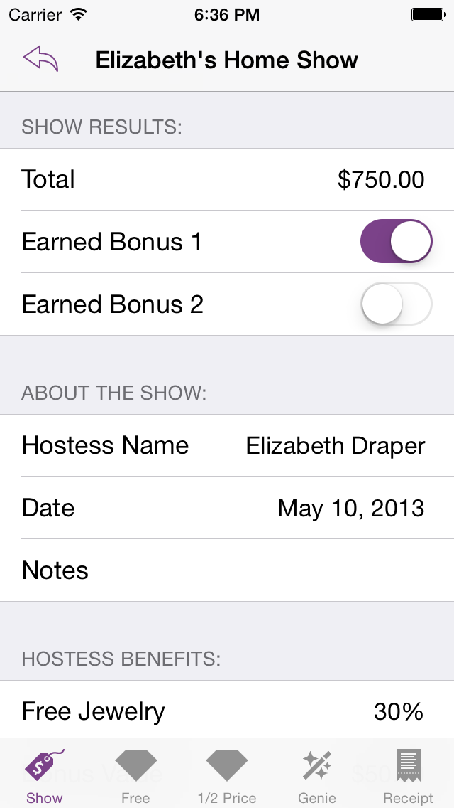
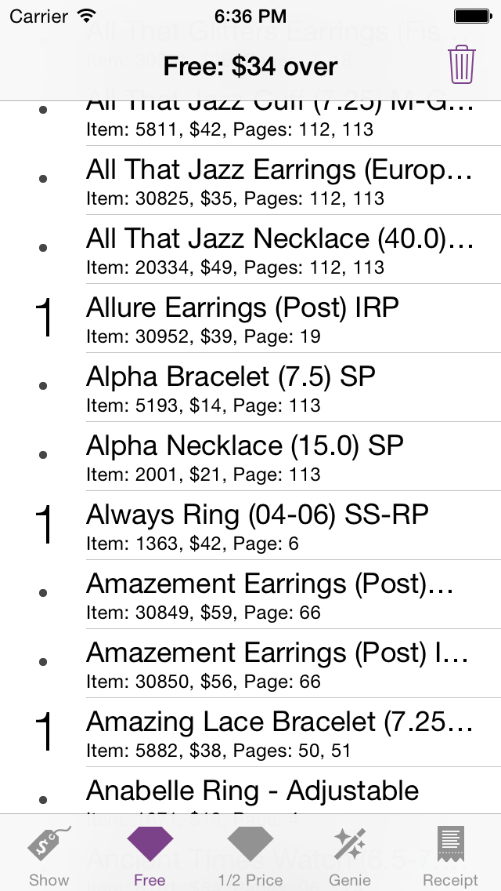

# Show Closer 

#### A [RubyMotion](http://www.rubymotion.com/) application brought to you by [Off The Grid Apps](http://otgapps.io/).

You MUST be an authorized Jeweler to use this application.

Show Closer has some great features that you’ll love to use:

- Quick Lookup screen to find item prices and page numbers on the go!
- Saving of multiple hostess orders and wishlists.
- Automatic calculation of your hostess 30% benefits and bonuses with customizable settings for promotions from the Home Office.
- Quickly enter the show total and the bonuses earned by the hostess. These numbers are easy to change and will recalculate the show on the fly!
- A curated database of all the current! Quickly find the pieces your hostess wants FREE and HALF PRICE and watch her credit automatically recalculate!
- Seamless internet updates means you’ll never have to worry that your database is out of date.
- Quickly search the jewelry database and add items to the hostess’s wishlist.
- Search the full database of jewelry by item number or name. Our database also includes recently retired pieces!
- The “Jewelry Genie” automatically figures out the best deal for the pieces your hostess wants!
- An exact replica of the hostess receipt with everything filled out for you. Just copy it on to the hostess’s physical receipt and you’re done! You can email the receipt to your hostess when you’ve finalized the show!

************
Please Read:
************
In order to make sure that you have the most recent and accurate list of Jewelry, this app utilizes in-app purchases to update the database when a new catalog comes out. Data updates for the Fall/Winter and Spring/Summer collections are an additional fee.

The Christmas catalog update is FREE. Once the new catalog is released, we will do our best to get the database updated as quickly as possible and it is generally complete before Rally is over! Your app will prompt you to purchase the updated data when it is available. Updates will be $4.99 each.

#### Note: 

The Show Closer is an app written specifically for independent distributors of [Premier Designs high fashion jewelry](http://www.premierdesigns.com/). _This app is useless for anyone else!_ (unless you're looking at the code to learn about RubyMotion)

## Download from the App Store

## How to run the app:

1. You must have a valid license of RubyMotion.
2. Run `bundle`
3. Run `rake pod:install`
4. Run `RUBYMOTION_TESTER=true rake` (the first part is VERY critical - it will bypass the identification checks so that you can check out the app without being an independent distributor)
5. The simulator should launch automatically.

## Screenshots

    

## Contributing:

1. You probably don't want to contribute to this app.
